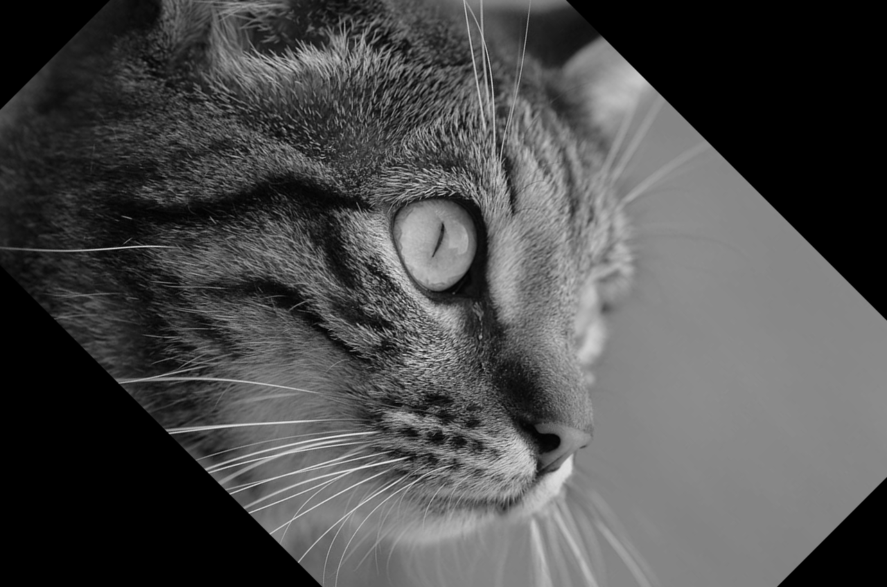

# kmsz

Notes and projects from Kaeli, Mistry, Schaa, and Zhang's _Heterogeneous Computing with OpenCL 2.0_

<div align="center">
    
</div>

For developer notes, see [README.dev.md](README.dev.md).

## `querying`

Query the device for some of its properties and print them

```console
$ ./dist/bin/querying
There is 1 OpenCL platform on the host:
   Platform 1 of 1: Intel(R) OpenCL Graphics
   There is 1 device on the platform:
      device 1 of 1
         CL_DEVICE_NAME               Intel(R) Iris(R) Xe Graphics
         CL_DEVICE_VENDOR             Intel(R) Corporation
         CL_DEVICE_VENDOR_ID          0x8086
         CL_DEVICE_VERSION            OpenCL 3.0 NEO
         CL_DRIVER_VERSION            23.43.027642
         CL_DEVICE_OPENCL_C_VERSION   OpenCL C 1.2
         CL_DEVICE_PROFILE            FULL_PROFILE
         CL_DEVICE_TYPE               CL_DEVICE_TYPE_GPU
```

## `add`

Vector addition using the first OpenCL capable device found.

```console
$ ./dist/bin/add
Usage: ./dist/bin/add KERNELDIR

    Vector addition using the first OpenCL capable device found

    KERNELDIR  directory that holds the OpenCL kernel
               files (can be a relative path)
```

```console
$ ./dist/bin/add ./dist/share/kmsz/assets/kernels
first 3 elements:
0 2 4
last 3 elements:
4090 4092 4094
```

## `histogram`

Use local memory and `atomic_inc` to calculate partial histograms, then use `atomic_add`
to aggregate local histograms into the global histogram. Finally, verify the result
against a serial implementation.

```console
$ ./dist/bin/histogram
Usage: ./dist/bin/histogram KERNELDIR

    Calculate a histogram using the first OpenCL capable device found

    KERNELDIR  directory that holds the OpenCL kernel named
               'histogram.cl' (can be a relative path)
$ ./dist/bin/histogram ./dist/share/kmsz/assets/kernels/
1 platform
1 device
Intel(R) Iris(R) Xe Graphics
        96 CL_DEVICE_MAX_COMPUTE_UNITS
        64 CL_DEVICE_PREFERRED_WORK_GROUP_SIZE_MULTIPLE
       512 CL_DEVICE_MAX_WORK_GROUP_SIZE
   2073601 image size
   2074112 global work size (padded image size)
       512 local work size (group size)
      4051 ngroups
Histogram calculated successfully
```

## `rotation`

Rotate an image 45 degrees clockwise using the first OpenCL capable device found.

- Note on the host both `image` and `rotated` are of type `uint8_t` but on the device they
  are 32-bit `float`s.
- Variables of type `image2d_t` (as well as any other image type) are stored in the device's
  texture buffer, not regular shared memory or global VRAM.

```console
$ ./dist/bin/rotate
Usage: ./dist/bin/rotate IMAGE KERNELDIR

    Rotate an image 45 degrees clockwise using the first OpenCL capable device found.
    Output file name is IMAGE minus .bmp plus .out.bmp (overwrites if file exists).

    IMAGE      path to an 8-bit grayscale BMP image (can be
               relative to working directory). Image dimensions
               should be a multiple of 4.

    KERNELDIR  directory that holds the OpenCL kernel named
               'rotate.cl' (can be relative to working directory)

$ ./dist/bin/rotate ../images/cat1280x848.bmp ./dist/share/kmsz/assets/kernels/
1 platform
1 device

image:
nrows          = 848
ncols          = 1280
image[      0] = 31
image[   1279] = 118
image[1084160] = 155
image[1085439] = 139

rotated:
nrows          = 848
ncols          = 1280
image[      0] = 0
image[   1279] = 0
image[1084160] = 0
image[1085439] = 0

input file   ../images/cat1280x848.bmp
output file  ../images/cat1280x848.out.bmp
rotating the image took 0.316 s (walltime)
```

image:


rotated image:



## `increment`

Increment an integer on the device.

```console
$ ./dist/bin/increment
Usage: ./dist/bin/increment KERNELDIR

    Increment an integer on the device.

    KERNELDIR  directory that holds the OpenCL kernel named
               'increment.cl' (can be relative to working directory)

$ ./dist/bin/increment ./dist/share/kmsz/assets/kernels/
1 platform
1 device
before: 100
after : 101
```

## `pass-struct`

Pass a struct to the kernel to illustrate required alignment.

```console
$ ./dist/bin/pass-struct
Usage: ./dist/bin/pass-struct KERNELDIR

    Pass a struct to the kernel to illustrate required alignment.

    KERNELDIR  directory that holds the OpenCL kernel named
               'pass-struct.cl' (can be relative to working directory)

```

When compiled with `-DKMSZ_USE_KERNEL_ASSERTS=ON`:

```console
$ ./dist/bin/pass-struct ./dist/share/kmsz/assets/kernels/
1 platform
1 device
kernel didn't report any problems
```

When compiled with `-DKMSZ_USE_KERNEL_ASSERTS=OFF`:

```console
$ ./dist/bin/pass-struct ./dist/share/kmsz/assets/kernels/
ERROR 67: program is only useful when compilation variable KMSZ_USE_KERNEL_ASSERTS has been defined, aborting
```

## Acknowledgements

_This project was initialized using [Copier](https://pypi.org/project/copier) and the [copier-template-for-c-projects](https://github.com/jspaaks/copier-template-for-c-projects)._
